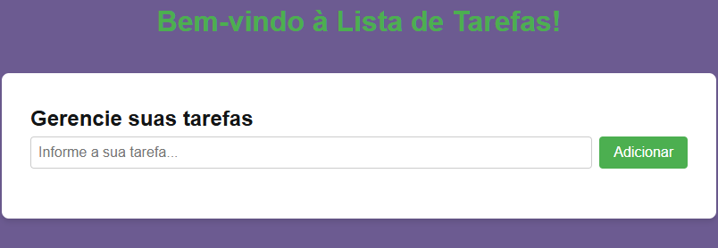

# To-Do List App



📌 Sobre o Projeto
O **To-Do List App** é uma aplicação web simples e interativa para ajudar os usuários a organizar suas tarefas diárias. Com uma interface intuitiva, permite adicionar, remover e marcar tarefas como concluídas.

## 🚀 Funcionalidades
- 📌 Adicionar novas tarefas
- ✅ Marcar tarefas como concluídas
- ❌ Remover tarefas da lista
- 📁 Armazenamento local para manter as tarefas salvas

## 🎨 Tecnologias Utilizadas
- HTML5
- CSS3
- JavaScript (Vanilla JS)

## 📂 Como Executar o Projeto
Você pode acessar a versão online [aqui](https://tatianakami.github.io/To-do-list-app/) ou seguir os passos abaixo para rodar localmente:

1. Clone o repositório:
   ```sh
   git clone https://github.com/TatianaKami/To-do-list-app.git
   ```
2. Acesse a pasta do projeto:
   ```sh
   cd To-do-list-app
   ```
3. Abra o arquivo `index.html` no navegador.

## 🛠 Melhorias Futuras
- 🔄 Editar tarefas existentes
- 📅 Adicionar prazo para tarefas
- 🎨 Melhorar design e experiência do usuário

## 📜 Licença
Este projeto está sob a licença MIT.

## 👩‍💻 Autor
Desenvolvido por **Tatiana Kami**. Conecte-se comigo no [LinkedIn](https://www.linkedin.com/in/tatiana-kami).